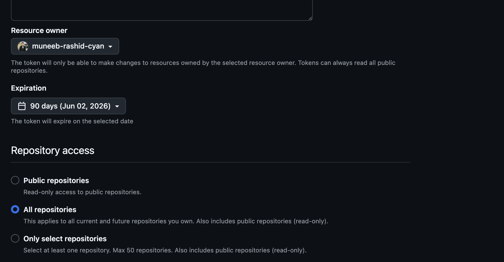

# LangGraph SQL Agent

A production-oriented AI agent that answers natural language questions about an e-commerce database using LangGraph. The agent autonomously inspects the database schema, writes SQL queries, executes them, self-corrects on errors, and requires human approval before returning the final answer.

---

## What This Agent Does

```
You ask:  "Who are the top 3 customers by total spending?"

Agent:
  → inspects database schema        (tool call)
  → writes and executes SQL query   (tool call)
  → self-corrects if SQL fails      (error recovery loop)
  → presents answer for your review (human-in-the-loop)
  → revises if you request changes  (revision loop)
```

---

## LangGraph Concepts Covered

| Concept | Description |
|---|---|
| `StateGraph` | Graph-based agent orchestration |
| `TypedDict` State | Typed shared memory across all nodes |
| `add_messages` reducer | Appends messages instead of replacing (full conversation memory) |
| `@tool` decorator | Defines tools the LLM can call |
| `bind_tools()` | Sends tool schemas to the LLM |
| `ToolNode` | Executes tool calls from LLM responses |
| ReAct loop | think → act → observe → repeat |
| `MemorySaver` checkpointer | Persists state across conversation turns |
| `thread_id` | Isolates each conversation session |
| `interrupt()` | Pauses graph for human review |
| `Command(resume=...)` | Resumes graph after human decision |
| Conditional edges | Dynamic routing based on state |
| Error recovery | Agent reads SQL errors and self-corrects |

---

## Graph Architecture

```
START
  │
[agent]  ←─────────────────────────┐
  │                                 │
  ├── has tool_calls? → [tools] ────┘   ReAct loop
  │
  └── final answer?  → [human_review]
                            │
                            ├── approved  → END
                            └── revision  → [agent]
```

     
---

## Project Structure

```
LangGraph-SQL-Agent/
├── .env                  ← API keys (not committed)
├── .gitignore
├── requirements.txt
├── setup_db.py           ← creates and seeds the SQLite database
├── main.py               ← CLI entry point
└── agent/
    ├── state.py          ← AgentState TypedDict (shared memory)
    ├── tools.py          ← SQL tools (@tool functions)
    ├── nodes.py          ← node functions + edge routing logic
    └── graph.py          ← graph wiring + checkpointer
```

---

## Database Schema

The sample e-commerce database is created by `setup_db.py` and contains:

| Table | Description |
|---|---|
| `customers` | 20 customers with name, email, city |
| `products` | 30 products across 6 categories with price and stock |
| `orders` | 150 orders with status and total amount |
| `order_items` | Line items linking orders to products |

---

## Setup

### 1. Clone the repository
```bash
git clone https://github.com/muneeb-rashid-cyan/LangGraph-SQL-Agent.git
cd LangGraph-SQL-Agent
```

### 2. Create and activate virtual environment (macOS)
```bash
python3 -m venv venv
source venv/bin/activate
```

### 3. Install dependencies
```bash
pip install -r requirements.txt
```

### 4. Configure environment variables
```bash
cp .env.example .env
```
Open `.env` and add your OpenAI API key:
```
OPENAI_API_KEY=your_key_here
MODEL=gpt-4o
DB_PATH=ecommerce.db
```

### 5. Create the database
```bash
python setup_db.py
```

### 6. Run the agent
```bash
python main.py
```

---

## Example Questions to Try

```
"What are the top 5 best-selling products by revenue?"
"Which city has the most customers?"
"Show monthly revenue for the past 6 months"
"Which products have less than 50 units in stock?"
"Who are the top 3 customers by total spending?"
"What percentage of orders were cancelled?"
"Which product category generates the most revenue?"
"How many orders were placed in the last 30 days?"
```

---

## Human-in-the-Loop

After the agent formulates an answer, it pauses and asks for your approval:

```
HUMAN REVIEW REQUIRED
Proposed answer:

The top 3 customers by total spending are...

Approve this answer? (y/n):
```

- Type `y` to accept
- Type `n` to request a revision — the agent will ask for your feedback and try again

---

## Optional: Enable LangSmith Tracing

Add these to your `.env` to get full observability and tracing:

```
LANGCHAIN_TRACING_V2=true
LANGCHAIN_API_KEY=your_langsmith_key_here
LANGCHAIN_PROJECT=LangGraph-SQL-Agent
```

---

## Requirements

- Python 3.10+
- OpenAI API key

--

## Tech Stack

- [LangGraph](https://github.com/langchain-ai/langgraph) `>=0.3.34`
- [LangChain](https://github.com/langchain-ai/langchain) `>=0.3.24`
- [LangChain OpenAI](https://github.com/langchain-ai/langchain/tree/master/libs/partners/openai)
- SQLite (built into Python)


